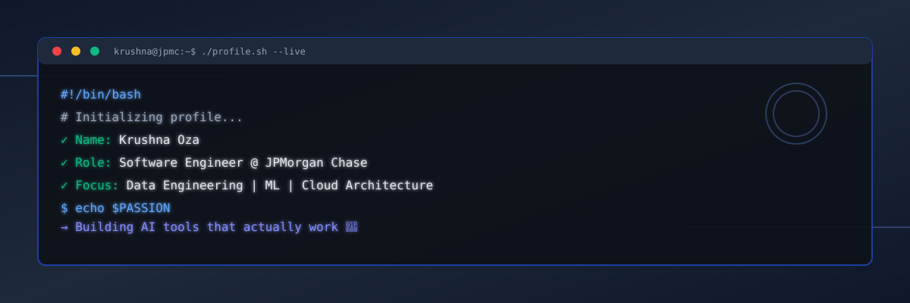

<div align="center">

<!-- Dynamic banner that adapts to dark/light mode -->
<picture>
  <source media="(prefers-color-scheme: dark)" srcset="assets/banner-dark.svg">
  <source media="(prefers-color-scheme: light)" srcset="assets/banner-light.svg">
  
</picture>

<br><br>

<!-- Animated typing banner -->
<a href="https://github.com/krishna7083">
  
</a>

<br><br>

<!-- Social badges -->
<a href="https://linkedin.com/in/krushna-oza"></a>&nbsp;&nbsp;
<a href="https://github.com/krishna7083"></a>&nbsp;&nbsp;
<a href="mailto:mishrarabin18@gmail.com"></a>

<br><br>


</div>

---


## 🧑‍💻 `whoami`

```python
class KrushnaOza:
    """
    Software Engineer specializing in large-scale data systems,
    ML personalization, and cloud-native architecture.
    """
    
    name       = "Krushna Oza"
    location   = "Hyderabad, Telangana, India 🇮🇳"
    role       = "Software Engineer @ JPMorgan Chase 🏦"
    
    career     = ["TCS", "Reliance Jio", "TechMojo", "JPMorgan Chase"]
    
    expertise  = [
        "Data Engineering & Big Data Pipelines",
        "Backend Microservices Architecture",
        "Cloud-Native Solutions (AWS)",
        "ML & Recommendation Systems",
        "AI Tooling & MCP Servers"
    ]
    
    tech_stack = {
        "languages": ["Java", "Python", "Go", "SQL"],
        "big_data": ["Spark", "Kafka", "Cassandra", "Snowflake"],
        "cloud": ["AWS EMR", "Glue", "Lambda", "ECS", "S3", "Step Functions"],
        "backend": ["Spring Boot", "REST APIs", "Microservices"],
        "devops": ["Kubernetes", "Docker", "CI/CD"],
        "ai_ml": ["MCP Servers", "LLM Integration", "Recommendation Engines"]
    }
    
    current_focus = {
        "day_job": "Processing millions of txns → real-time insights 📊",
        "side_hustle": "Building custom MCP servers to supercharge AI 🤖",
        "passion": "Making AI tools that actually solve real problems"
    }
    
    motto = "Build for scale. Design for clarity. Ship with confidence. 🚀"
```

<br clear="right"/>

---

## 👋 Hey there, I'm Krushna!

I'm a **Software Engineer** from **Hyderabad, Telangana 🇮🇳** — currently at **JPMorgan Chase & Co.**, where I build systems that process **millions of customer transactions** daily and transform raw data into actionable financial intelligence.

**My journey:**
- 🏗️ **TCS** — Built strong engineering foundations in enterprise Java
- 📡 **Reliance Jio** — Scaled backend systems for hundreds of millions of Indian users
- 🚀 **TechMojo** — Grew into Senior SDE, introduced Golang to the stack
- 🏦 **JPMorgan Chase** — Currently engineering data pipelines & ML personalization at scale

Beyond the day job, I'm obsessed with the intersection of **AI and engineering** — I build **custom MCP (Model Context Protocol) servers** that connect LLMs to real-world tools, APIs, and data sources, making them dramatically more capable. If you believe the future belongs to engineers who can *build with AI*, not just *use AI* — we'll get along great. 🤝

> 💡 *I write code that scales, design systems that last, and build AI tools that actually do something useful.*

---

## 🏢 Career Timeline

```
TCS  ──────►  Reliance Jio  ──────►  TechMojo  ──────►  JPMorgan Chase
 🏗️                📡                   🚀                    🏦
Fresher         Telecom Scale        Senior SDE         FinTech @ Scale
2019-2020         2020-2021          2021-2023            2023-Present
```

<br/>

### 🏦 JPMorgan Chase & Co. — *Software Engineer*
 &nbsp; `📍 India` &nbsp; `🗓️ 2023 – Present`

> Working on the **Personalization & Insights Platform** — a mission-critical system processing **millions of customer transactions** daily to generate real-time behavioral insights and hyper-personalized recommendations for Chase's retail banking customers.

**Key Contributions:**
- ⚡ Engineered high-throughput **data pipelines** using Apache Spark on **AWS EMR**, **Glue**, and **Step Functions** — processing millions of records with strict latency SLAs
- 🔁 Built event-driven microservices with **Apache Kafka** for real-time transaction streaming and personalization triggers
- 🧠 Contributed to **ML Recommendation Engine** — collaborative filtering + behavioral modeling serving personalized financial offers at customer scale
- 🗄️ Designed low-latency data access layers with **Apache Cassandra** for high-read workloads; **Snowflake** feature stores for ML pipelines
- ☁️ Full-stack AWS: `EMR · Glue · Lambda · ECS · EC2 · Step Functions · CloudWatch · S3 · SNS · SQS`
- 🐳 Container orchestration via **Kubernetes** with comprehensive observability
- 🔒 Security-first engineering in a highly regulated financial environment

`Java` `Python` `Spring Boot` `Apache Spark` `Kafka` `Cassandra` `Kubernetes` `AWS` `Snowflake` `ML`

---

### 🚀 TechMojo Solutions — *Senior Software Engineer*
`📍 India` &nbsp; `🗓️ 2021 – 2023`

> Core backend engineer evolving into senior role — led design and implementation of critical microservices and introduced performance-oriented technologies.

**Key Contributions:**
- 🛠️ Architected **RESTful microservices** with Java + Spring Boot; introduced **Golang** for performance-critical components
- 📨 Designed async inter-service communication with **Apache Kafka** — improved system resilience and decoupled business flows
- ⚡ Implemented **Redis** caching strategies, dramatically reducing DB load and improving API response times
- ☁️ Hands-on **AWS** infrastructure: EC2, S3, RDS — deployment, scaling, monitoring
- 🧪 Led code reviews, maintained CI/CD pipelines, drove test coverage standards
- 🏅 Earned **CodeChef CCDSAP Foundation Certification**

`Java` `Golang` `Spring Boot` `Kafka` `Redis` `MySQL` `AWS` `Microservices` `REST APIs`

---

### 📡 Reliance Jio — *Software Engineer*
`📍 India` &nbsp; `🗓️ 2020 – 2021`

> Built backend services for India's largest telecom ecosystem, serving **hundreds of millions of users**.

**Key Contributions:**
- 📶 Developed scalable backend systems for Jio's digital services portfolio
- 🔧 Worked with high-volume APIs and distributed systems at telecom scale
- 🤝 Agile cross-functional collaboration with emphasis on uptime and reliability
- 📊 Deep exposure to large-scale distributed system design patterns

`Java` `Spring` `REST APIs` `Microservices` `Distributed Systems`

---

### 🏗️ Tata Consultancy Services (TCS) — *Software Engineer*
`📍 India` &nbsp; `🗓️ 2019 – 2020`

> Foundation of my corporate engineering journey at India's largest IT services company.

**Key Contributions:**
- 🎓 Enterprise Java development, design patterns, software engineering best practices
- 🔨 Contributed to client-facing projects with structured SDLC and agile workflows
- 🌱 Built strong fundamentals in **Java**, **SQL**, **REST APIs**, and **OOP**

`Java` `SQL` `REST APIs` `OOP` `SDLC` `Agile`

---

## 🤖 AI Engineering & MCP Servers

```
╔═══════════════════════════════════════════════════════════════════════╗
║           🧩  CUSTOM MCP SERVER DEVELOPMENT                          ║
╠═══════════════════════════════════════════════════════════════════════╣
║  ► Built MCP (Model Context Protocol) servers from scratch           ║
║  ► Exposed domain-specific tools, APIs & data as callable actions    ║
║  ► Enabled LLMs (Claude, GPT) to query live systems & take action    ║
║  ► Used for: code assist, data retrieval & knowledge augmentation    ║
║  ► Result: dramatically improved model accuracy & task performance   ║
╠═══════════════════════════════════════════════════════════════════════╣
║  💡 Why MCP?                                                          ║
║     MCP servers are the bridge between AI and the real world.         ║
║     You're not just using AI — you're shaping HOW it reasons.         ║
╚═══════════════════════════════════════════════════════════════════════╝
```

<div align="center">


</div>

---

## 🛠️ Tech Stack & Tools

<div align="center">

### Programming Languages
[](https://skillicons.dev)

### Backend & Frameworks
[](https://skillicons.dev)

### Data & Databases


### Cloud & DevOps
[](https://skillicons.dev)

### AWS Services


### AI & ML


</div>

---

## 📊 GitHub Statistics

<div align="center">


&nbsp;&nbsp;


<br/><br/>


<br/><br/>


<br/><br/>

<!-- GitHub Trophies -->


</div>

---

## 🏆 Career Highlights

<div align="center">

| 🎯 | Achievement |
|:---:|:---|
| 🏦 | **JPMorgan Chase** — Engineering personalization platform processing millions of daily transactions |
| 📡 | **Reliance Jio** — Built backend systems serving 400M+ Indian telecom users |
| 🚀 | **TechMojo** — Promoted to Senior SDE; introduced Golang into production stack |
| 🏗️ | **TCS** — Established enterprise engineering fundamentals at India's largest IT services company |
| ⚙️ | **AWS Expert** — Full-stack data engineering: Spark/EMR · Glue · Lambda · Step Functions · S3 |
| 🤖 | **AI Pioneer** — Built custom MCP servers extending LLM capabilities with real-world tool access |
| 🧠 | **ML Engineer** — Contributed to recommendation engine serving personalized banking at scale |
| 🏅 | **CodeChef CCDSAP Certified** — Validated data structures & algorithms expertise |

</div>

---

## 💼 What I'm Working On

<div align="center">

```javascript
const currentProjects = {
    work: {
        focus: "Data pipelines & ML personalization @ JPMorgan Chase",
        scale: "Millions of transactions/day → Real-time insights",
        tech: ["Spark", "Kafka", "AWS", "Cassandra", "Snowflake"]
    },
    
    side: {
        focus: "Custom MCP servers for AI agents",
        goal: "Bridge the gap between LLMs and real-world systems",
        tech: ["Python", "TypeScript", "Claude API", "OpenAI"]
    },
    
    learning: {
        now: ["Advanced ML", "Distributed Systems", "AI Agents"],
        next: ["Rust", "System Design at Scale", "LLM Fine-tuning"]
    }
}
```

</div>

---

## 💬 Engineering Philosophy

<div align="center">

```
  ┌──────────────────────────────────────────────────────────┐
  │                                                          │
  │   "Build for scale. Design for clarity.                  │
  │    If it breaks under load — it was never ready.         │
  │    If nobody can read it — it was never done."           │
  │                                                          │
  │               — Krushna Oza                              │
  └──────────────────────────────────────────────────────────┘
```

</div>

---

## 📫 Let's Connect

<div align="center">

*Open to interesting conversations, side projects, AI experiments, and good tech discussions* ☕

<br>

[](https://linkedin.com/in/krushna-oza)
[](https://github.com/krishna7083)
[](mailto:mishrarabin18@gmail.com)

<br><br>

### 📈 Support My Work

If you find my projects useful or learn something from my code, consider:

[](https://github.com/krishna7083?tab=repositories)
[](https://github.com/krishna7083)

</div>

---

<div align="center">

### 💭 Random Dev Quote


<br>

### 😂 Here's a Joke for You


</div>

---

<div align="center">


<br>

<sub>🤖 Built with passion by [@krishna7083](https://github.com/krishna7083) • Last updated: 2026</sub>

</div>
